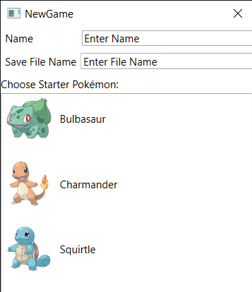
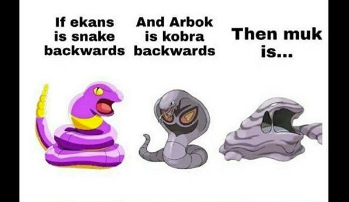

# Bootleg Pokégame
----
A WPF application that aims to accurately replicate pokémon battles. It does this in the form of a pokémon battle game. It comes with additional features such as evolving, releasing pokémon, buying items (potions and pokéballs) from the shop and allowing the player to fight in tournaments.

## Motivation
Back when I was a kid (and even now), I was fascinated by the pokémon series. I was so intrigued by it that I wouldn't miss a single game. Although now that that excitement and "addiction" of mine towards pokémon has decreased, I still sometimes find a way to watch a couple of episodes of the anime once in while. One day, I felt like giving a tribute to the ***legendary*** franchise. This being the reason I took up this project.

## Game Screen

- The **menu bar** has two options:
  - **File** : Create, save, delete game files.
  - **Actions** : Fight wild pokémon/trainers, fight in tournaments, buy items, release/evolve pokémon and view pokédex.

- Below the menu bar is the pokémon **battle screen**. This is where the player can select the moves they want to use on the enemy pokemon, see their pokémon's HP, level and the enemy pokémon's stats.

- To the right of this screen are the **player details**. Below which are the player's **inventory**. Below which are the **pokémon currently in the player's collection**. The player can choose the pokémon they want to battle or they can choose it to view it's stats.

- The **status bar** is below the battle screen. This shows which pokémon used which move, wheter or not it did damage, who won, how much money the player lost (in trainer battles and tournaments) and how much XP the pokemon gained.

As is with the case with any aspiring pokémon trainer, you begin your journey by selecting a *stater pokémon*. You use this to catch other pokémon and fulfill your dream of becoming the greatest pokémon trainer to ever live ([cause Ash was in a coma the whole time](https://numoviesreview.info/2020/07/22/pokemon-theory-ash-is-actually-in-a-coma-the-whole-time/)).

#### To try out the project:
Simply clone the repository, open visual studio, build and run!!!

## Credits
- [Bulbapedia](https://bulbapedia.bulbagarden.net/wiki/Main_Page) for details about damage and stat calculation, trainer badges and pokémon.
- [Pokémon DB](https://pokemondb.net/) for evolution charts of pokémon.
- This [repository](https://github.com/fanzeyi/pokemon.json) I found on github which gave base stats of pokémon and attack base stats.

## Contributing
- Fork the repository.
- Make the changes you want to.
- Create a pull request.

#### ***Gotta catch 'em all!!***

## License
This project was created under the [MIT License](LICENSE)
